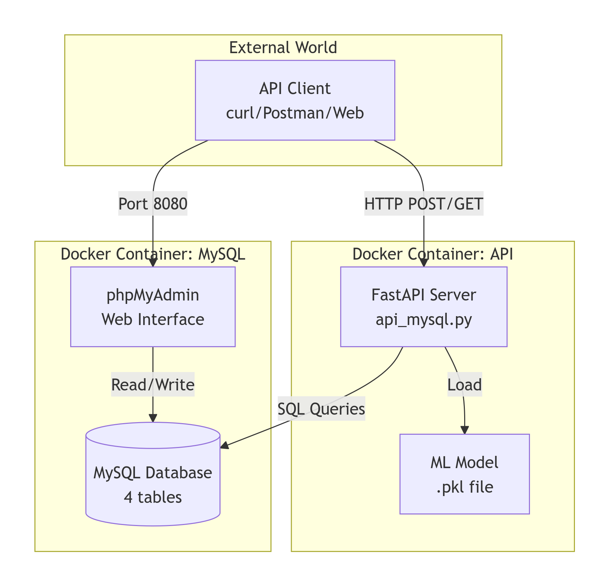

# KLOE BDT Particle Detection API
[](https://www.python.org/)
[](https://fastapi.tiangolo.com/)
[](https://xgboost.readthedocs.io/)
[](https://mysql.com/)
[](https://docker.com/)

> **For research methodology and BDT training**, see [README.md](README.md)

## Table of Contents
- [Project Overview](#project-overview)
- [Architecture](#architecture)
- [Features](#features)
- [Quick Start](#quick-start)
- [Deployment](#deployment)
- [Useful Operations](#useful-operations)
- [Port Management](#port-management)
- [API Server Management](#api-server-management)

## Project Overview
```
KLOE_BDT Deployment/
├── mysql_db.py           # Database layer (persistence)
├── api_mysql.py          # API layer (business logic)
├── init_bdt.py          # Initialize 'kloe_bdt' database, and fill in a few test events
├── models/
│   └── pi0_classifier_model_TCOMB.pkl # Trained ML model 
├── requirements.txt          # Dependencies
├── Dockerfile                # Dockerfile
├── docker-compose.mysql.yml  # Container orchestration
└── PROJECT_SWD.md            # Documentation
```
## Architecture
Client → FastAPI → XGBoost Model → MySQL → Prediction


<div align="center">

<br/>
<em>KLOE BDT Deployment Architecture</em>
</div>

## Features

- ✅ **10-feature ML model** (XGBoost, 0.9869 AUC on validation)
- ✅ **RESTful API** with automatic Swagger documentation
- ✅ **MySQL persistence** with 5,000+ event storage
- ✅ **Batch predictions** (100+ events/second)
- ✅ **Docker support** for cloud deployment
- ✅ **Health checks** & monitoring endpoints
- ✅ **GPU acceleration** for training

## Quick Start

```bash
# Clone repository
git clone https://github.com/yourusername/KLOE_BDT
cd KLOE_BDT

# Make scripts executable
chmod +x start_api.sh stop_api.sh multi_pred.sh

# Start the API server
./start_api.sh

# In another terminal, make a prediction
./single_photon_pair.sh # single paired-photon
./multi_photon_pair.sh # multiple paired-photon accociated to the same event

# Or use curl directly
curl -X POST "http://localhost:8000/predict-and-save" \
  -H "Content-Type: application/json" \
  -d '{
    "run_number": 12345,
    "event_number": 67890,
    "photon_pairs": [{
      "m_gg": 135.2,
      "opening_angle": 0.85,
      "cos_theta": 0.5,
      "E_asym": 0.12
    }]
  }'
```

## Deployment

### 1. Python MySQL Connector

```bash
uv run mysql_db.py
```


### 2. Initialize 'kloe_bdt' Database
```bash
uv run init_bdt.py
# Type "YES" when prompted, or, "DROP" to drop existing database
```


### 3. FastAPI + MySQL Integration
```bash
uv run api_mysql.py
# Or use the start script: 
./start_api.sh
```

### 4. Docker Deployment
#### 4.0 File check
```text
KLOE_BDT/
├── Dockerfile              # Docker file
├── docker-compose.yml      # Multi-container arrangement (API + MySQL)
├── requirements.txt        # Python dependencies
├── api_mysql.py            # FastAPI application
├── mysql_db.py             # Database module
├── init_bdt.py             # Database initialization
├── models/                 # Trained model
│   └── pi0_classifier_model_TCOMB.pkl
└── start_api.sh            # Starting script (optional)

# .env file (inluded in .gitignore)
MYSQL_ROOT_PASSWORD=your-root_password
MYSQL_DATABASE=your-database-name
MYSQL_USER=your-user-name
MYSQL_PASSWORD=your-user-password
MYSQL_HOST=your-host-name

# ./docker_user.sh

```
#### 4.1 Create requirements.txt
```text
awkward
fastapi
grip
joblib
matplotlib
mysql-connector-python
numpy
pandas
psutil
pyarrow
scikit-learn
scikit-optimize
seaborn
uproot
uvicorn
xgboost
```

#### 4.2 Create a Dockerfile
```dockerfile
# Dockerfile
FROM python:3.12-slim

# Set working directory
WORKDIR /app

RUN apt-get update && apt-get install -y \
    gcc \
    default-libmysqlclient-dev \
    pkg-config \
    curl \
    && rm -rf /var/lib/apt/lists/*

# Copy requirements first (for better caching)
COPY requirements.txt .
RUN pip install --no-cache-dir -r requirements.txt

# Copy application code
COPY api_mysql.py .
COPY mysql_db.py .
COPY init_bdt.py .
COPY models/ ./models/

# Expose port
EXPOSE 8000

# Health check
HEALTHCHECK --interval=30s --timeout=3s --start-period=5s --retries=3 \
    CMD curl -f http://localhost:8000/health || exit 1

# Run the application
CMD ["uvicorn", "api_mysql:app", "--host", "0.0.0.0", "--port", "8000"]
```

#### 4.3 Create docker-compose.yml (includes MySQL)
version: (implied, modern Compose)
├── services:
│   ├── mysql (database)
│   ├── api (web application)
│   └── init-db (one-time setup)
├── volumes: (persistent storage)
└── networks: (communication bridge)
```yaml
# docker-compose.yml
services:
  mysql:
    image: mysql:8
    container_name: kloe-mysql
    environment:
      MYSQL_ROOT_PASSWORD: ${MYSQL_ROOT_PASSWORD}
      MYSQL_DATABASE: ${MYSQL_DATABASE}
      MYSQL_USER: ${MYSQL_USER}
      MYSQL_PASSWORD: ${MYSQL_PASSWORD}
    ports:
      - "3306:3306"
    volumes:
      - mysql_data:/var/lib/mysql
    healthcheck:
      test: ["CMD", "mysqladmin", "ping", "-h", "localhost", "-u", "root", "-p${MYSQL_ROOT_PASSWORD}"]
      interval: 10s
      timeout: 10s
      retries: 5
      start_period: 30s  # Give MySQL time to initialize
    networks:
      - kloe-network
    command: --mysql-native-password=ON  # Better compatibility

  api:
    build: .
    container_name: kloe-api
    ports:
      - "8000:8000"
    environment:
      MYSQL_HOST: mysql
      MYSQL_USER: ${MYSQL_USER}
      MYSQL_PASSWORD: ${MYSQL_PASSWORD}
      MYSQL_DATABASE: ${MYSQL_DATABASE}
    depends_on:
      mysql:
        condition: service_healthy
    healthcheck:
      test: ["CMD", "curl", "-f", "http://localhost:8000/health"]
      interval: 30s
      timeout: 10s
      retries: 3
      start_period: 10s
    networks:
      - kloe-network
    restart: unless-stopped

  # Optional: Add an init service to run init_bdt.py automatically
  init-db:
    build: .
    container_name: kloe-init
    command: python init_bdt.py
    environment:
      MYSQL_HOST: mysql
      MYSQL_USER: ${MYSQL_USER}
      MYSQL_PASSWORD: ${MYSQL_PASSWORD}
      MYSQL_ROOT_PASSWORD: ${MYSQL_ROOT_PASSWORD}
      MYSQL_DATABASE: ${MYSQL_DATABASE}
    depends_on:
      mysql:
        condition: service_healthy
    networks:
      - kloe-network
    volumes:
      - ./models:/app/models  # Mount models directory if needed
    profiles:
      - init  # Only run when explicitly requested

volumes:
  mysql_data:

networks:
  kloe-network:
    driver: bridge
```

#### 4.4 Update api_mysql.py for Docker
```text
Modify your api_mysql.py to read database host from environment
```

#### 4.5 Create Environment File (.env)
```bash
# .env file（included in .gitignore）
MYSQL_ROOT_PASSWORD=secret
MYSQL_DATABASE=kloe_bdt
MYSQL_USER=kloe_user
MYSQL_PASSWORD=your_db_password
```

#### 4.6 Build and Run with Docker Compose on Other Devices
**Installations on the target device**
```bash
# 1. Install Docker:
curl -fsSL https://get.docker.com -o get-docker.sh
sudo sh get-docker.sh

# 2. Install Docker Compose
sudo apt install docker-compose-plugin

# 3. Add user to docker（avoid using sudo every time）
sudo usermod -aG docker $USER
# Re-login validation
```
**Step-by-step deployment:**
```bash
# 1. Copy to the target device
git clone https://github.com/yourusername/KLOE_BDT.git
cd KLOE_BDT

# 2. Create .env 文件（set password）
cp .env.example .env
# Edit .env password setting

# 3. Make sure the model exists
ls -la models/pi0_classifier_model_TCOMB.pkl

# 4. Activate Docker container（one-line）
./docker_user.sh
docker-compose --profile init up init-db

# 5. Inspection
docker compose ps
docker compose logs api
# Application running at http://localhost:8000

# 6. Test API
curl http://localhost:8000/health

# 7. Initialize manually（if needed）
docker compose exec api python init_bdt.py

# 8. Exit
# When you're done for now
docker compose down

# Later when you want to start again
docker compose up
```


#### 4.7 Additional commands after the deployment
```text
# Check log
docker compose logs -f api
docker compose logs -f mysql

# Reboot
docker compose restart api

# Stop Docker
docker compose down

# Stop and delete data（complete clean）
docker compose down -v

# Enter the container and tune
docker compose exec api bash
docker compose exec mysql bash

# Update deployment（after git pushed）
git pull
docker compose build (build)
docker compose up -d (start)
Or:
docker compose up -d --build (combined)
```

<!--
### Keywords
```markdown
**Technical Skills**
- Databases: MySQL (advanced), SQLite, query optimization, indexing
- API Development: FastAPI, RESTful design, async endpoints
- ML Engineering: XGBoost, GPU acceleration, model deployment
- DevOps: Docker, docker-compose, MySQL replication
```
-->

## Useful Operations

### Docker MySQL Setup
```bash
# Run MySQL container
docker run --name mysql-kloe -e MYSQL_ROOT_PASSWORD=secret -p 3306:3306 -d mysql:8
```

### MySQL Installation (Ubuntu/Debian)
```bash
# Install MySQL
sudo apt update
sudo apt install mysql-server mysql-client
sudo mysql_secure_installation
```

### Check MySQL Status
```bash
# Check version
mysql --version
# Output: mysql  Ver 8.0.36-0ubuntu0.22.04.1 for Linux on x86_64

# Check all MySQL packages
dpkg -l | grep -E "mysql|mariadb"

# Check if running
sudo systemctl status mysql
sudo service mysql status

# Start/Stop MySQL
sudo systemctl start mysql
sudo systemctl stop mysql
sudo systemctl restart mysql

# Enable auto-start on boot
sudo systemctl enable mysql

# List all containers
sudo docer ps -a

# See only a specific project container
sudo docker ps -a | grep <container_name>

# Stop a container
sudo docker stop <container_name>

# Remove a container
sudo docker rm <container_name>
```

**Found MySQL Credentials**
```bash
sudo cat /etc/mysql/debian.cnf
# DO NOT use debian-sys-maint for your application! This is an internal maintenance account that Debian/Ubuntu uses for system tasks.
```

**Setup Private User**
- Login with debian-sys-maint to set up root/user
```bash
mysql -u debian-sys-maint -p 
# Enter password obtained from sudo cat /etc/mysql/debian.cnf
```

- Set root password (if not set)
```sql
ALTER USER 'root'@'localhost' IDENTIFIED WITH mysql_native_password BY 'secret';
FLUSH PRIVILEGES;

CREATE DATABASE IF NOT EXISTS kloe_bdt;

CREATE USER IF NOT EXISTS 'kloe_user'@'localhost' IDENTIFIED BY 'kloe_password';

GRANT ALL PRIVILEGES ON kloe_bdt.* TO 'kloe_user'@'localhost';

FLUSH PRIVILEGES;

SHOW DATABASES;
SELECT user, host FROM mysql.user;
SHOW GRANTS FOR 'kloe_user'@'localhost';

EXIT;
```

## Port Management
```bash
# Find process using port 8000
sudo lsof -i :8000

# Kill process on port 8000
sudo fuser -k 8000/tcp

# Or kill by process ID
kill -9 <PID>
```

## API Server Management
```bash
# Start server
./start_api.sh

# Stop server
./stop_api.sh

# Check if running
pgrep -f "uvicorn api_mysql:app"

# View logs
tail -f api.log

# Check health
curl http://localhost:8000/health
```

## Troubleshooting

### Common Issues and Solutions

| Issue | Solution |
|-------|----------|
| **Port 8000 already in use** | `sudo fuser -k 8000/tcp` or `./stop_api.sh` |
| **Database connection refused** | Check MySQL: `sudo systemctl status mysql` |
| **Model not found error** | Run training first: `python main_training_gpu.py` |
| **Permission denied for scripts** | `chmod +x *.sh` |
| **uv: command not found** | Install uv: `pip install uv` or use `python3` instead |
| **MySQL authentication error** | Run setup queries in "Setup Private User" section |

### Quick Debug Commands

```bash
# Check if API is responding
curl http://localhost:8000/health

# Check database connection
mysql -u kloe_user -p -e "USE kloe_bdt; SHOW TABLES;"

# Check model file exists
ls -la models/pi0_classifier_model_TCOMB.pkl

# View API logs
tail -f api.log

# Check if port is listening
netstat -tulpn | grep 8000
```