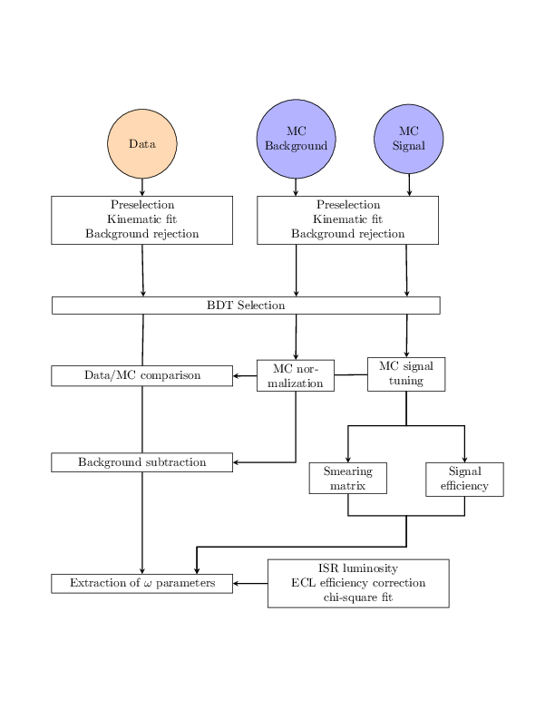
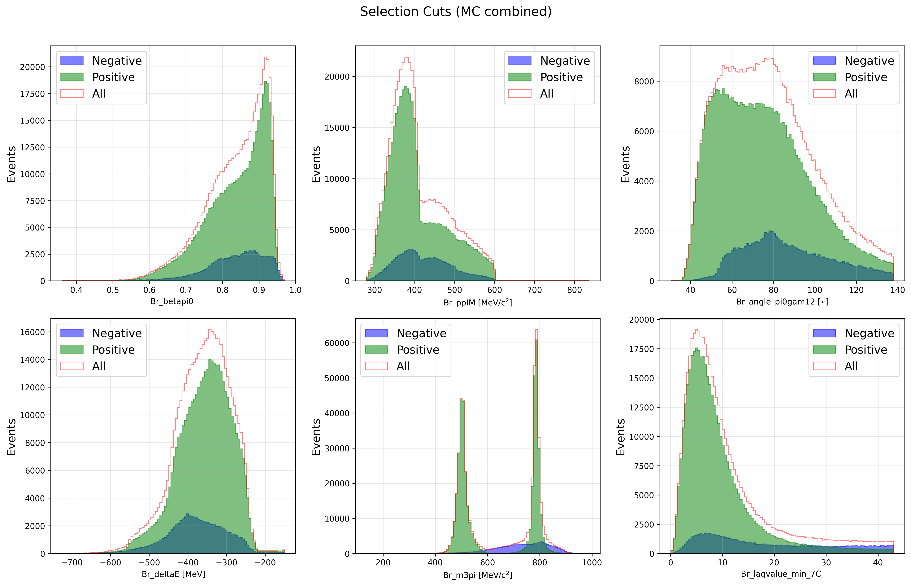

## 📚 Table of Contents
- [Overview](#-overview)
- [Standard Analysis ($\chi^{2}$)](#-standard-analysis-χ)
- [BDT Analysis](#-bdt-analysis)
- [Data Preparation](#-data-preparation)
- [BDT Training & Evaluation](#-bdt-training--evaluation)
- [Performance Metrics](#-performance-metrics)
- [Quick Start](#-quick-start)
- [Repository Structure](#-repository-structure)

## 💡 Overview
This project analyzes the $e^{+}e^{-}\to\pi^{+}\pi^{-}\pi^{0}\gamma$ ISR process, using a $1.7~\text{fb}^{-1}$ data sample collected at KLOE.

<div align="center">

<br/>
<em>Figure 1: Analysis workflow for Monte Carlo (MC) simulated events and data, beginning with events passing the trigger and selected by the FILFO and KSL streams. The final state of all events is reconstructed using a kinematic fit that includes e⁺e⁻ → π⁺π⁻π⁰ photon pairing.</em>

</div>

## 🚀 Quick Start {#-quick-start}
> **BDT model:** 
```bash
root - l -q $HOME/input_kloe.sh 
# Output: $HOME/Destop/input_kloe_chain/cut/tree_pre.root
# BDT training requires tree_pre.root before selection cuts. Modify $HOME/Destop/KLOE_BDT/run_bdt/tree_cut.C, comment off all cut condtions 
``` 
<div align="center">

<br/>
<em>Figure 1: Kinematic variables distribution before selection cuts</em>
    
</div>


## 📐 Analysis Flow

### 1.Data Preparation
#### Input Raw Data 
```bash
script/listpath_chain.sh # listing path of raw data root files stored as a text input file. Or listpath_norm.sh for larger data samples
# Outputs: $HOME/Destop/KLOE_BDT/path_norm/*
```

#### Create ROOT Files 
```bash
root -l -b -q run_bdt/Process.C #prompt, small samples
# Outputs: $HOME/Desktop/sig.root

./run_bdt/script/input_bdt.sh 
# Outputs: $HOME/Desktop/input_bdt_TDATA_chain/*
```

