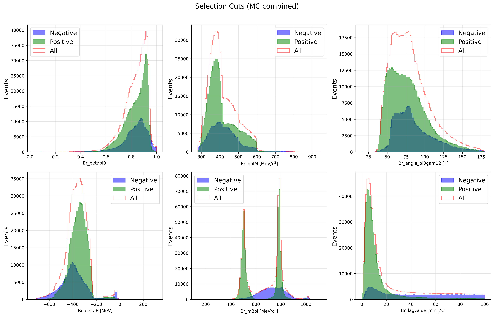
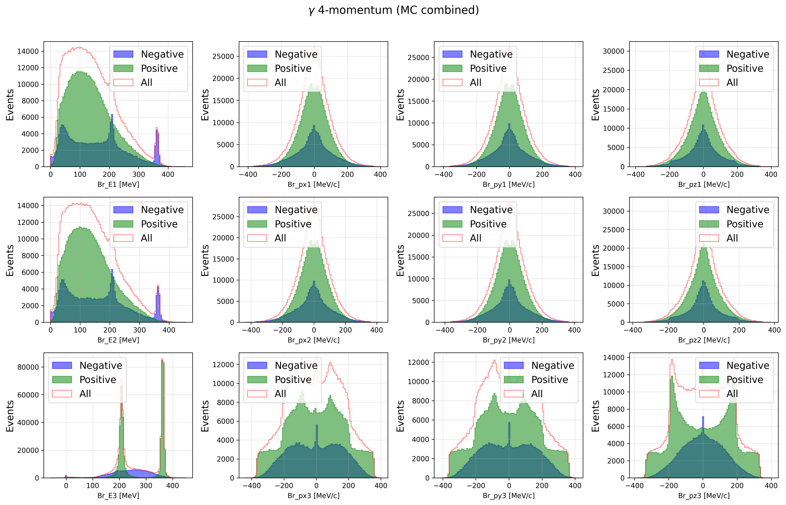
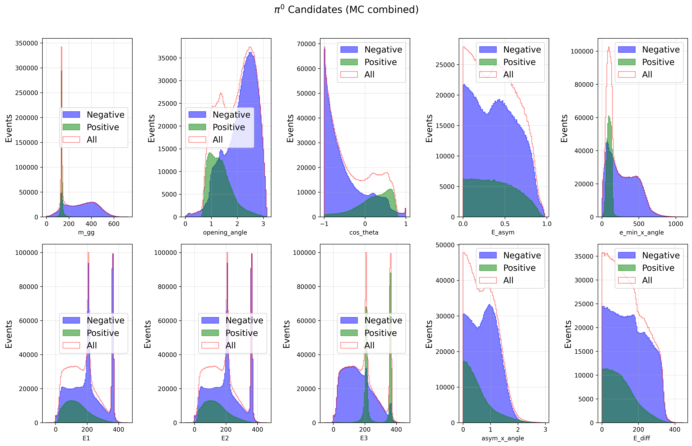
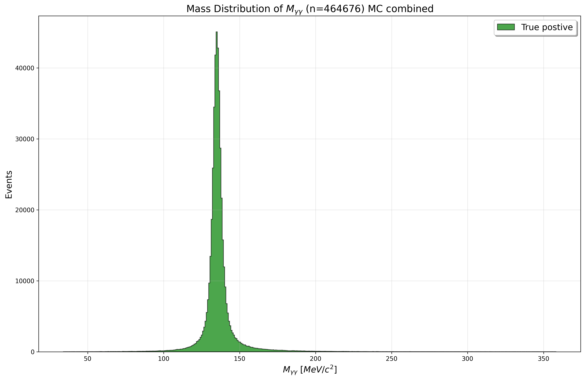
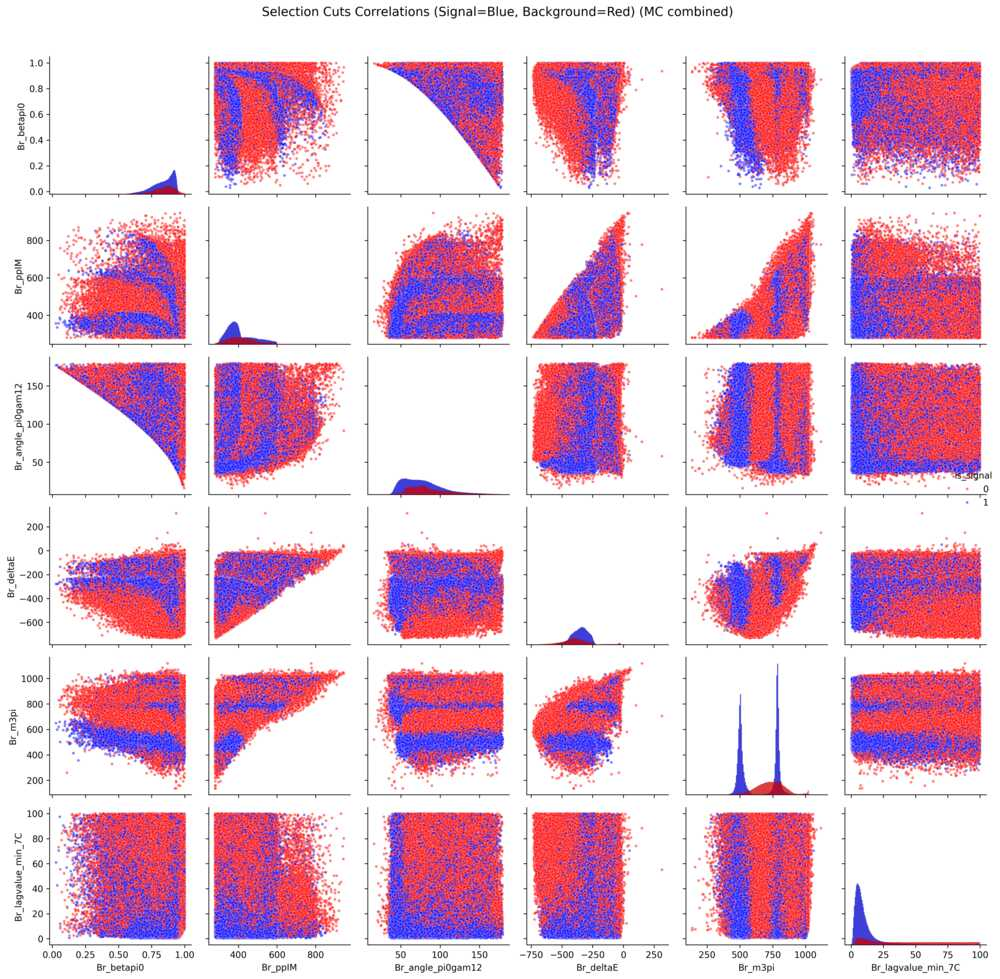
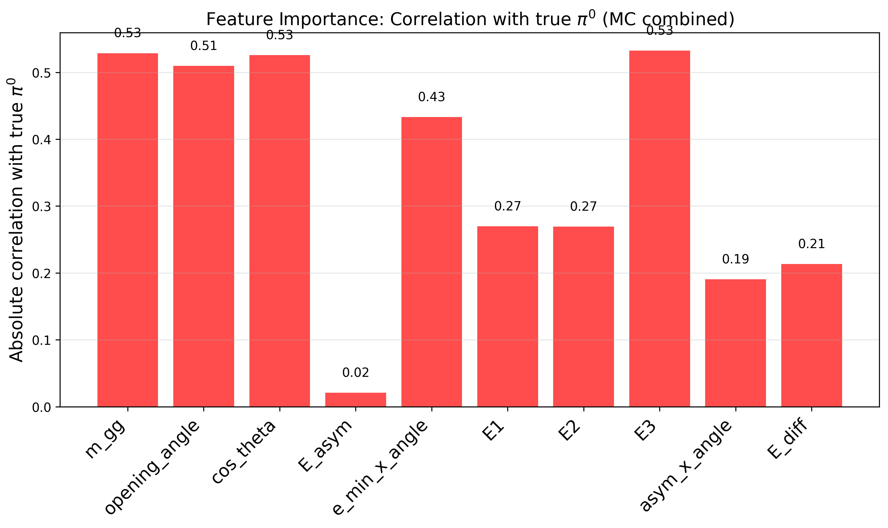

[](https://urn.kb.se/resolve?urn=urn:nbn:se:uu:diva-551484)
[](https://xgboost.ai)
[](https://root.cern)
[](LICENSE)

## 📚 Table of Contents
- [Overview](#-overview)
- [Standard Analysis ($\chi^{2}$)](#-standard-analysis-χ)
- [BDT Analysis](#-bdt-analysis)
- [Data Preparation](#-data-preparation)
- [BDT Training & Evaluation](#-bdt-training--evaluation)
- [Performance Metrics](#-performance-metrics)
- [Quick Start](#-quick-start)
- [Repository Structure](#-repository-structure)

## 💡 Description
This project re-analyzes the KLOE experiment's $e^{+}e^{-}\to\pi^{+}\pi^{-}\pi^{0}\gamma$ ISR process, comparing traditional $\chi^{2}$-based $\pi^{0}$ reconstruction with a modern **XGBoost BDT** approach.

| Aspect | $\chi^{2}$ Method | BDT Method |
|:-------|:----------|:------------|
| **Approach** | Analytical minimization | Machine learning |
| **Input features** | Mass difference only | 7+ kinematic variables |

**📖 Thesis Reference:**  
This analysis is based on the methodology described in:  

> *A Study of the e⁺e⁻ → π⁺π⁻π⁰ Process Using Initial State Radiation*  
> Author: Bo Cao 
> Institution: Uppsala University  
> DiVA: https://urn.kb.se/resolve?urn=urn:nbn:se:uu:diva-551484  

---

## 📐 Standard Analysis ($\chi^{2}$)

### Method
Reconstructed $\pi^{0}\to\gamma\gamma$ in the final state using chi-square selection: 

$$\chi^2_{M_{\gamma\gamma}}=\frac{(M_{\gamma\gamma}-m_{\pi^{\text{0}}})^2}{\sigma^2_{M_{\gamma\gamma}}}, ~~~~~ \frac{\sigma_{M_{\gamma\gamma}}}{M_{\gamma\gamma}}=\frac{1}{2}\sqrt{\left(\frac{\sigma_{1}}{E_1}\right)^{2}+\left(\frac{\sigma_{2}}{E_2}\right)^{2}}$$

**Selection criteria:**
The pair of photons $\gamma_{1}$ and $\gamma_{2}$ is chosen such that the reconstructed mass $M_{\gamma\gamma}$ is closest to the mass constraint $$m_{\pi^{0}}=\sqrt{2E_{1}E_{2}\left(1-\text{cos}\theta_{12}\right)}.$$ 

The $\chi^{2}$-test is performed on event-by-event basis, and the energy-dependent relative error $\sigma_{M_{\gamma\gamma}}/M_{\gamma\gamma}$ is directly associated with the uncertainties of the photon energies $\sigma_{1}$, $\sigma_{2}$. Uncertainty contributions from both the measured angles and the correlations between $E_{1}$ and $E_{2}$ are considered negligible. The test is conducted for each photon pair, and the combination with the smallest chi-square value $\chi^{2}_{\gamma\gamma}$ provides the best candidates for the $\pi^{0}$ decay photons. The efficiency of $\pi^{0}$ decay photon identification can be estimated by comparing the selected photons to the true MC information. 

<!--**📂 Reference:** [KLOE_REPO](https://github.com/boaca926-beep/KLOE_REPO.git)
-->

## 🤖 BDT Analysis
**Related repository:** [KLOE_REPO](https://github.com/boaca926-beep/KLOE_BDT.git)    

## 💡 Overview
This analysis replaces the traditional $\chi^{2}$ method with a Gradient Boosted Decision Tree (BDT) approach using XGBoost, incorporating multiple kinematic variables for improved $\pi^{0}$ reconstruction.

### Key Features for BDT
<!--
| Feature | Formula | Implementation | Range |
|:--------|:--------|:---------------|:------|
| **Invariant Mass** | `m = √((E₁+E₂)² - \|p₁+p₂\|²)` | `inv_mass_4vector(γᵢ, γⱼ)` | > 0 |
| **Opening Angle** | `θ = arccos((p₁·p₂)/(\|p₁\|\|p₂\|))` | `np.arccos(np.clip(cosθ, -1, 1))` | [0, π] |
| **Energy Asymmetry** | `A = \|E₁-E₂\|/(E₁+E₂)` | `np.abs(e1-e2)/(e1+e2+1e-10)` | [0, 1] |
| **Energy Ratio** | `R = min(E₁,E₂)/max(E₁,E₂)` | `min(e1,e2)/max(e1,e2)` | [0, 1] |
| **Energy Difference** | `ΔE = \|E₁-E₂\|` | `np.abs(e1-e2)` | ≥ 0 |
| **Min Energy × Angle** | `min(E₁,E₂) × θ` | `min(e1,e2) * theta` | ≥ 0 |
| **Asymmetry × Angle** | `A × θ` | `e_asym * theta` | ≥ 0 |
-->

| Feature | Formula | Physical Meaning |
|:--------|:--------|:------------------|
| **Invariant Mass** | $M_{\gamma\gamma} = \sqrt{(E_1+E_2)^2 - \|\mathbf{p}_1+\mathbf{p}_2\|^2}$ | $\pi^{0}$ mass constraint |
| **Opening Angle** | $\theta = \arccos\left(\frac{\mathbf{p}_1\cdot\mathbf{p}_2}{\|\mathbf{p}_1\|\|\mathbf{p}_2\|}\right)$ | $\pi^{0}$ decay angular distribution |
| **Energy Asymmetry** | $A = \frac{\|E_1-E_2\|}{E_1+E_2}$ | Symmetry of decay |
| **Energy Ratio** | $R = \frac{\min(E_1,E_2)}{\max(E_1,E_2)}$ | Energy balance |
| **Energy Difference** | $\Delta E = \|E_1-E_2\|$ | Absolute energy asymmetry |
| **Min Energy × Angle** | $\min(E_1,E_2) \times \theta$ | Combined kinematic constraint |
| **Asymmetry × Angle** | $A \times \theta$ | Weighted angular measure |

### Signal vs Background Definition

| Class | Definition | Label | Example |
|:------|:-----------|:------|:---------|
| **Signal** | Correct $\pi^{0}$ photon pair that matches Monte Carlo truth, identified as the pair with minimum $\chi^{2}_{M_{\gamma\gamma}}$ value | 1 | True $\pi^{0}\to\gamma\gamma$ decay from $e^{+}e^{-}\to\pi^{+}\pi^{-}\pi^{0}\gamma$ and $e^{+}e^{-}\to\phi\to\eta\gamma\to\pi^{+}\pi^{-}\pi^{0}\gamma$|
| **Background** | • **Combinatorial**: Wrong photon pairing (e.g., photons from different $\pi^{0}$ decays or ISR) <br> • **Physical channel**: Events from other processes ($e^{+}e^{-}\to\omega\pi^{0}\to\pi^{+}\pi^{-}\pi^{0}\gamma\gamma$, $e^{+}e^{-}\to e^{+}e^{-}\gamma$, etc.) | 0 | Two uncorrelated photons misidentified as $\pi^{0}$ |

**Training/Validation/Test Split:** 70% / 15% / 15%
        
## 🚀  Data Preparation
> **🎯 What:** BDT-based $\pi^{0}$ reconstruction replacing traditional $\chi^{2}$ selection  
> **⚙️ How:** XGBoost with CUDA acceleration on ROOT data from KLOE experiment  
> **📈 Key improvement:** Better signal/background separation for $e^{+}e^{-}\to\pi^{+}\pi^{-}\pi^{0}\gamma$  
> **🚀 Quick start:** `uv sync && uv run main_initialize_kloe_opti.py`

### 1. Input Raw Data 
```bash
script/listpath.sh # listing path of raw data root files stored as a text input file  
# Outputs: path_chain/*
```

### 2. Create ROOT Files 
```bash
root -l -b -q run_bdt/Process.C #prompt, small samples
# Outputs: /home/bo/Desktop/sig.root

./run_bdt/script/input_bdt.sh (analysis, large samples)
# Outputs: input_bdt_TDATA_chain/input/sig.root (analysis)
```

### 3. Convert to BDT Format
```bash
root -l -b -q run_bdt/get_bdt_sample.C # prompt, small samples
# Outputs: KLOE_BDT/dataset/sig_bdt.root

script/get_bdt_sample.sh        # analysis, large samples
# Outputs: KLOE_BDT/dataset/kloe_bdt.root
```

## 🚀 BDT Training & Evaluation
### Enviroment Setup
```bash 
# Install UV if not already installed
curl -LsSf https://astral.sh/uv/install.sh | sh

# Clone repository
git clone https://github.com/boaca926-beep/KLOE_BDT.git
cd KLOE_BDT

# Using UV (recommended)
uv sync

# Activate environment
source .venv/bin/activate

# Or using pip/uv with requirements
uv add -r requirements.txt

# Working Space 
cd /home/kloe/Desktop/KLOE_BDT/bdt
```

#### Requirements:

- Python 3.10+

- CUDA 12.x (for GPU acceleration)

- XGBoost 2.0+

- ROOT 6.30+

### Step 1. Data Splitting
```bash
# Splitting dataset to training, validation, and test
uv run main_initialize_kloe_opti.py /
    --input /home/kloe/Desktop/KLOE_BDT/dataset/kloe_bdt.root / --chunk-size 50000 /
    --output-dir /home/kloe/Desktop/KLOE_BDT/dataset_bdt
# Outputs: dataset_bdt/*
```

### Step 2. Features Inspection
```bash
# Inspecting photon features and features of all paired-photon combinations
uv run main_inspect.py
# Generates plot in /home/kloe/Desktop/KLOE_BDT/plots_inspect/
```

<!-- 
*Figure 1: Comparison of kinematic variables between single photons and photon pairs from $\pi^{0}$ decay*
-->

**Diagnostic Plots:**
<div align="center">

<br/>
<em>Figure 1: Kinematic variables distribution after selection cuts</em>
    
<br/><br/>


<br/>
<em>Figure 2: 4-momentum features of photons in the final state</em>

<br/><br/>


<br/>
<em>Figure 3: Features of paired-photon combinations for π⁰ reconstruction</em>

<br/><br/>


<br/>
<em>Figure 4: Reconstructed π⁰ mass peak at nominal value (135 MeV/c²)</em>

<br/><br/>


<br/>
<em>Figure 5: Correlations of features of paired-photon combinations for π⁰ reconstruction</em>

<br/><br/>


<br/>
<em>Figure 6: Feature-target correlations of paired-photon combinations for π⁰ reconstruction</em>

</div>
    

### Step 3. Hyperparameter Tuning

**Search Space:**
| Parameter | Description | Search Range | Script Default | Optimized From Bayesian |
|:----------|:------------|:-------------|:---------------|:------------------------|
| `n_estimators` | Number of boosting rounds | 100 - 1000 | N/A (set in baye_opti) | ✓ |
| `max_depth` | Maximum tree depth | 3 - 10 | 10 | ✓ |
| `learning_rate` | Boosting learning rate | 0.01 - 0.3 | 0.1 | ✓ |
| `subsample` | Fraction of samples per tree | 0.6 - 1.0 | 0.8 | ✓ |
| `colsample_bytree` | Fraction of features per tree | 0.6 - 1.0 | 0.8 | ✓ |
| `gamma` | Minimum loss reduction for split | 0 - 5 | 0 | ✓ |
| `reg_alpha` | L1 regularization (alpha) | 0 - 1 | 0 | ✓ |
| `reg_lambda` | L2 regularization (lambda) | 0 - 2 | 1 | ✓ |
| `min_child_weight` | Minimum sum instance weights in child | 1 - 10 | 1 | ✓ |
| `max_bin` | Maximum bins for histogram | 256 - 1024 | 512 | Fixed |
| `early_stopping_rounds` | Early stopping patience | 20 - 100 | 50 | Fixed |
| `nthread` | Number of CPU threads | 1 - max_cores | 12 | Fixed |

```bash
# Run training with hyperparameter search
uv run main_training_gpu.py
# Output: /home/kloe/Desktop/KLOE_BDT/models/pi0_classifier_model_TCOMB.pkl
```

### Step 4. Model Evaluation
    
- Confusion matrix 
                   
- ROC and AUC plots
    
- Best threshold determination

### Step 5. Final testing

## 📊 Performance Metrics

- ROC curve and AUC score

- Confusion matrix

- Optimized threshold selection

## 📝 Citation

If you use this code in your research, please cite:

```bibtex
@thesis{cao2024kloe,
  author = {Bo Cao},
  title = {A Study of the $e^{+}e^{-}\to\pi^{+}\pi^{-}\pi^{0}$ Process Using Initial State Radiation},
  institution = {Uppsala University},
  year = {2024},
  url = {https://urn.kb.se/resolve?urn=urn:nbn:se:uu:diva-551484}
}
```

## 📄 License

This project is licensed under the **MIT License** - see the [LICENSE](LICENSE) file for details.

### Summary of MIT License
- ✅ Commercial use allowed
- ✅ Modification allowed
- ✅ Distribution allowed
- ✅ Private use allowed
- ❌ No warranty or liability
- ❌ Must include copyright notice

For full license text, see the [LICENSE](LICENSE) file in the repository root.

## 🙏 Acknowledgments

### Institutional Support
- **KLOE Collaboration** - For providing experimental data, detector expertise, and physics validation
- **Uppsala University** - Department of Physics and Astronomy for academic support and resources
- **INFN Laboratori Nazionali di Frascati** - For operating the KLOE detector

### Software & Tools
- **XGBoost Contributors** - For the gradient boosting framework with CUDA support
- **CERN ROOT Team** - For the data analysis framework used throughout this project
- **Optuna Developers** - For hyperparameter optimization framework
- **NumPy/SciPy Community** - For fundamental scientific computing tools
- **scikit-learn Team** - For machine learning utilities and metrics

### Academic Guidance
- **Thesis Supervisor(s)** - For guidance on physics analysis methodology
- **KLOE Analysis Group** - For valuable discussions and feedback

### Open Source Community
- **GitHub** - For hosting and version control
- **UV Development Team** - For Python package management

---

## 📧 Contact & Support

- **Author:** Bo Cao ([GitHub](https://github.com/boaca926-beep))
- **Issues:** [GitHub Issues](https://github.com/boaca926-beep/KLOE_BDT/issues)
- **Thesis Questions:** Refer to the DiVA thesis link above

---

<div align="center">
Made with ⚛️ for the KLOE experiment
</div>
