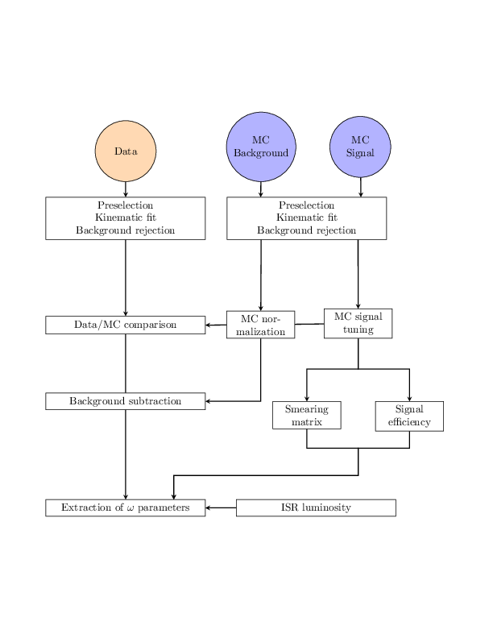

## 💡 Description
This project analyzes the $e^{+}e^{-}\to\pi^{+}\pi^{-}\pi^{0}\gamma$ ISR process, using a $1.7~\text{fb}^{-1}$ data sample collected at KLOE.

 
<em>Figure 1: Analysis workflow for Monte Carlo (MC) simulated events and data, beginning with events passing the trigger and selected by the FILFO and KSL streams. The final state of all events is reconstructed using a kinematic fit that includes e⁺e⁻ → π⁺π⁻π⁰ photon pairing.</em>

